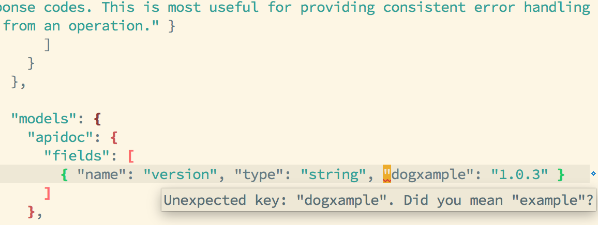

# apidoc-checker



A tool to validate apidoc specifications. Provides pretty error messages for
command-line use, and includes a Flycheck checker for Emacs.


## Usage

```
apidoc-checker - apidoc spec validator

Usage: apidoc-checker FILE [--plain]
  Validates an apidoc JSON specification

Available options:
  -h,--help                Show this help text
  FILE                     Path to the apidoc spec to validate
  --plain                  Remove ANSI colour codes from output.
```

## Installation

1. Install [stack][]

2. Clone this repository and install the tool with stack
   ```sh
   git clone https://github.com/chrisbarrett/apidoc-checker.git
   cd apidoc-checker
   stack install
   ```

### Flycheck Integration

1. Configure Emacs to use [MELPA][] as one of your package sources. This is
   already done for you in Spacemacs.

2. Run `M-x package-install-file apidoc-checker/elisp/apidoc-checker.el` to
   install the package and its dependencies.

When you visit api.json files you should now automatically enter `apidoc-mode`
and get those *sweet sweet* error squiggles.

## Contributions

PRs welcome.

## License

See [LICENSE][]. Copyright (c) 2016 Chris Barrett.

[stack]: http://docs.haskellstack.org/en/stable/README/
[LICENSE]: ./LICENSE
[MELPA]: http://melpa.org/#/getting-started
